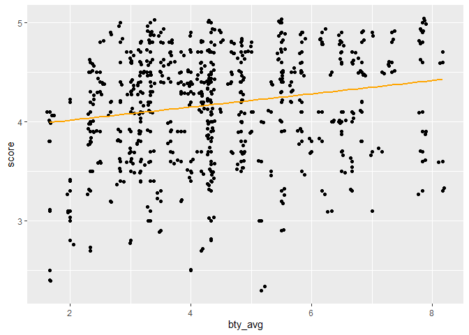

Lab 09 - Grading the professor, Pt. 1
================
Adam Paul
5-7-2022

### Load packages and data

``` r
library(tidyverse) 
library(tidymodels)
library(openintro)
```

``` r
evals <- evals
```

### Exercise 1

> Visualize the distribution of score. Is the distribution skewed? What
> does that tell you about how students rate courses? Is this what you
> expected to see? Why, or why not? Include any summary statistics and
> visualizations you use in your response.

``` r
evals %>%
  ggplot(aes(x = score)) +
  geom_histogram()
```

    ## `stat_bin()` using `bins = 30`. Pick better value with `binwidth`.

<!-- -->

``` r
summary(evals$score)
```

    ##    Min. 1st Qu.  Median    Mean 3rd Qu.    Max. 
    ##   2.300   3.800   4.300   4.175   4.600   5.000

There is a negative skew, such that students tend to score professors
relatively highly, mean being 4.175. This is pretty much what I
expected, assuming that evals are required. Most people don’t want to
get their professor in trouble if they like them, so if they’re forced
to answer they probably answer “mostly good”.

### Exercise 2

> Visualize and describe the relationship between score and the variable
> bty\_avg, a professor’s average beauty rating. Hint: See the help page
> for the function at
> <http://ggplot2.tidyverse.org/reference/index.html>.

``` r
evals %>%
  ggplot(aes(x = bty_avg , y = score)) +
  geom_point()
```

<!-- -->

Looking at it like this, I don’t see any real relationship.

# Exercise 3

> Replot the scatterplot from Exercise 2, but this time use
> geom\_jitter()? What does “jitter” mean? What was misleading about the
> initial scatterplot?

``` r
evals %>%
  ggplot(aes(x= bty_avg , y= score)) +
  geom_point() +
  geom_jitter()
```

<!-- -->

Jitter adds a bit of side-to-side variation to the points, to allow
there to be more visibility of points that are stacked on one another.
This was what was originally misleading, as the original didn’t show how
many points were present. It’s more clear that attractive professors
have less variability in their scores as compared to their
less-attractive coworkers.

### Exercise 4

> Let’s see if the apparent trend in the plot is something more than
> natural variation. Fit a linear model called m\_bty to predict average
> professor evaluation score by average beauty rating (bty\_avg). Based
> on the regression output, write the linear model.

``` r
m_bty <- lm(score ~ bty_avg, data=evals) 

print(m_bty)
```

    ## 
    ## Call:
    ## lm(formula = score ~ bty_avg, data = evals)
    ## 
    ## Coefficients:
    ## (Intercept)      bty_avg  
    ##     3.88034      0.06664

``` r
summary(m_bty)
```

    ## 
    ## Call:
    ## lm(formula = score ~ bty_avg, data = evals)
    ## 
    ## Residuals:
    ##     Min      1Q  Median      3Q     Max 
    ## -1.9246 -0.3690  0.1420  0.3977  0.9309 
    ## 
    ## Coefficients:
    ##             Estimate Std. Error t value Pr(>|t|)    
    ## (Intercept)  3.88034    0.07614   50.96  < 2e-16 ***
    ## bty_avg      0.06664    0.01629    4.09 5.08e-05 ***
    ## ---
    ## Signif. codes:  0 '***' 0.001 '**' 0.01 '*' 0.05 '.' 0.1 ' ' 1
    ## 
    ## Residual standard error: 0.5348 on 461 degrees of freedom
    ## Multiple R-squared:  0.03502,    Adjusted R-squared:  0.03293 
    ## F-statistic: 16.73 on 1 and 461 DF,  p-value: 5.083e-05

score = 3.88 + bty\_avg\*.067

### Exercise 5

> Replot your visualization from Exercise 3, and add the regression line
> to this plot in orange color. Turn off the shading for the uncertainty
> of the line.

``` r
evals %>%
  ggplot(aes(x= bty_avg , y= score)) +
  geom_point() +
  geom_jitter() +
  geom_smooth( method= lm, se= FALSE, color = "orange")
```

    ## `geom_smooth()` using formula 'y ~ x'

<!-- -->

### Exercise 6

> Interpret the slope of the linear model in context of the data.

The slope of the model is .067, which means that for every 1 point of
attractiveness a professor’s eval goes up .067 points

### Exercise 7

> Interpret the intercept of the linear model in context of the data.
> Comment on whether or not the intercept makes sense in this context.

The intercept is 3.88, which is the point at which the line crosses the
y axis (or when x=0). That is, even if a professor has an attractiveness
score of 0, they’d still have an average eval of 3.88. It’s a little odd
to consider what a 0 would be, and if we’re talking about how people are
usually perceived it might be more useful to know what the average
attractiveness gets on their evals.

### Exercise 8

> Determine the R2 of the model and interpret it in context of the data.

``` r
summary(m_bty)
```

    ## 
    ## Call:
    ## lm(formula = score ~ bty_avg, data = evals)
    ## 
    ## Residuals:
    ##     Min      1Q  Median      3Q     Max 
    ## -1.9246 -0.3690  0.1420  0.3977  0.9309 
    ## 
    ## Coefficients:
    ##             Estimate Std. Error t value Pr(>|t|)    
    ## (Intercept)  3.88034    0.07614   50.96  < 2e-16 ***
    ## bty_avg      0.06664    0.01629    4.09 5.08e-05 ***
    ## ---
    ## Signif. codes:  0 '***' 0.001 '**' 0.01 '*' 0.05 '.' 0.1 ' ' 1
    ## 
    ## Residual standard error: 0.5348 on 461 degrees of freedom
    ## Multiple R-squared:  0.03502,    Adjusted R-squared:  0.03293 
    ## F-statistic: 16.73 on 1 and 461 DF,  p-value: 5.083e-05

Multiple r-squared is .035. It tells us the overall variation that
attractiveness (the only predictor loaded into the model) accounts for
on score.

### Exercise 9

> Fit a new linear model called m\_gen to predict average professor
> evaluation score based on gender of the professor. Based on the
> regression output, write the linear model and interpret the slope and
> intercept in context of the data.

``` r
m_gen <- lm(score ~ gender, data=evals)  

print(m_gen)
```

    ## 
    ## Call:
    ## lm(formula = score ~ gender, data = evals)
    ## 
    ## Coefficients:
    ## (Intercept)   gendermale  
    ##      4.0928       0.1415

``` r
summary(m_gen)
```

    ## 
    ## Call:
    ## lm(formula = score ~ gender, data = evals)
    ## 
    ## Residuals:
    ##      Min       1Q   Median       3Q      Max 
    ## -1.83433 -0.36357  0.06567  0.40718  0.90718 
    ## 
    ## Coefficients:
    ##             Estimate Std. Error t value Pr(>|t|)    
    ## (Intercept)  4.09282    0.03867 105.852  < 2e-16 ***
    ## gendermale   0.14151    0.05082   2.784  0.00558 ** 
    ## ---
    ## Signif. codes:  0 '***' 0.001 '**' 0.01 '*' 0.05 '.' 0.1 ' ' 1
    ## 
    ## Residual standard error: 0.5399 on 461 degrees of freedom
    ## Multiple R-squared:  0.01654,    Adjusted R-squared:  0.01441 
    ## F-statistic: 7.753 on 1 and 461 DF,  p-value: 0.005583

### Exercise 10

> What is the equation of the line corresponding to male professors?
> What is it for female professors?

male: score = 4.09 + (1\*.1415)

female: score = 4.09 + (0\*.1415)

The difference should just be whether they are at the intercept or
above, since it’s dummy coded 0 and 1.

### Exercise 11

> Fit a new linear model called m\_rank to predict average professor
> evaluation score based on rank of the professor. Based on the
> regression output, write the linear model and interpret the slopes and
> intercept in context of the data.

``` r
m_rank <- lm(score ~ rank, data=evals) 

print(m_rank)
```

    ## 
    ## Call:
    ## lm(formula = score ~ rank, data = evals)
    ## 
    ## Coefficients:
    ##      (Intercept)  ranktenure track       ranktenured  
    ##           4.2843           -0.1297           -0.1452

``` r
summary(m_rank)
```

    ## 
    ## Call:
    ## lm(formula = score ~ rank, data = evals)
    ## 
    ## Residuals:
    ##     Min      1Q  Median      3Q     Max 
    ## -1.8546 -0.3391  0.1157  0.4305  0.8609 
    ## 
    ## Coefficients:
    ##                  Estimate Std. Error t value Pr(>|t|)    
    ## (Intercept)       4.28431    0.05365  79.853   <2e-16 ***
    ## ranktenure track -0.12968    0.07482  -1.733   0.0837 .  
    ## ranktenured      -0.14518    0.06355  -2.284   0.0228 *  
    ## ---
    ## Signif. codes:  0 '***' 0.001 '**' 0.01 '*' 0.05 '.' 0.1 ' ' 1
    ## 
    ## Residual standard error: 0.5419 on 460 degrees of freedom
    ## Multiple R-squared:  0.01163,    Adjusted R-squared:  0.007332 
    ## F-statistic: 2.706 on 2 and 460 DF,  p-value: 0.06786

Teaching: score= 4.28 + (0) + (0)

Because teaching is the reverence class, it has neither of the slopes of
the other to add to it. It is the score at “0” on rank. Adding the two
0’s shows that these two slopes exist, but neither applies.

Tenure track: score = 4.28 + (1\*-.1297)= 4.15

Tenured: score = 4.28 + (1\*-.1452)= 4.13

The other two have their own slopes, so I dropped showing the other
irrelevant slope.

### Exercise 12

> Create a new variable called rank\_relevel where “tenure track” is the
> baseline level.

``` r
evals <- evals %>% 
  mutate(rank_relevel = relevel(rank, ref = "tenure track"))
```

### Exercise 13

> Fit a new linear model called m\_rank\_relevel to predict average
> professor evaluation score based on rank\_relevel of the professor.
> This is the new (releveled) variable you created in Exercise 13. Based
> on the regression output, write the linear model and interpret the
> slopes and intercept in context of the data. Also determine and
> interpret the R2 of the model.

``` r
m_rank_relevel <- lm(score ~ rank_relevel, data=evals)
print(m_rank_relevel)
```

    ## 
    ## Call:
    ## lm(formula = score ~ rank_relevel, data = evals)
    ## 
    ## Coefficients:
    ##          (Intercept)  rank_relevelteaching   rank_releveltenured  
    ##               4.1546                0.1297               -0.0155

``` r
summary(m_rank_relevel)
```

    ## 
    ## Call:
    ## lm(formula = score ~ rank_relevel, data = evals)
    ## 
    ## Residuals:
    ##     Min      1Q  Median      3Q     Max 
    ## -1.8546 -0.3391  0.1157  0.4305  0.8609 
    ## 
    ## Coefficients:
    ##                      Estimate Std. Error t value Pr(>|t|)    
    ## (Intercept)           4.15463    0.05214  79.680   <2e-16 ***
    ## rank_relevelteaching  0.12968    0.07482   1.733   0.0837 .  
    ## rank_releveltenured  -0.01550    0.06228  -0.249   0.8036    
    ## ---
    ## Signif. codes:  0 '***' 0.001 '**' 0.01 '*' 0.05 '.' 0.1 ' ' 1
    ## 
    ## Residual standard error: 0.5419 on 460 degrees of freedom
    ## Multiple R-squared:  0.01163,    Adjusted R-squared:  0.007332 
    ## F-statistic: 2.706 on 2 and 460 DF,  p-value: 0.06786

Teaching: score= 4.15 + (1\*.1296)= 4.28

Tenure track: score= 4.15 + (0) + (0)

Tenured: score= 4.15 + (1\*-.0155)= 4.13

What we see is that tenured professors have a slight decline in scores
compared to the others, whereas teaching track have a slight
improvement.

The R squared is .012, so it accounts for a small amount of the
variance.

### Exercise 14

> Create another new variable called tenure\_eligible that labels
> “teaching” faculty as “no” and labels “tenure track” and “tenured”
> faculty as “yes”.

``` r
evals <- evals %>% 
  mutate(tenure_eligible = recode(rank, "tenure track" = "yes",
                                  "tenured" = "yes",
                                  "teaching" = "no"))
```

### Exercise 15

> Fit a new linear model called m\_tenure\_eligible to predict average
> professor evaluation score based on tenure\_eligibleness of the
> professor. This is the new (regrouped) variable you created in
> Exercise 15. Based on the regression output, write the linear model
> and interpret the slopes and intercept in context of the data. Also
> determine and interpret the R2 of the model.

``` r
m_tenure_eligible <- lm(score ~ tenure_eligible, data=evals)

print(m_tenure_eligible)
```

    ## 
    ## Call:
    ## lm(formula = score ~ tenure_eligible, data = evals)
    ## 
    ## Coefficients:
    ##        (Intercept)  tenure_eligibleyes  
    ##             4.2843             -0.1405

``` r
summary(m_tenure_eligible)
```

    ## 
    ## Call:
    ## lm(formula = score ~ tenure_eligible, data = evals)
    ## 
    ## Residuals:
    ##     Min      1Q  Median      3Q     Max 
    ## -1.8438 -0.3438  0.1157  0.4360  0.8562 
    ## 
    ## Coefficients:
    ##                    Estimate Std. Error t value Pr(>|t|)    
    ## (Intercept)          4.2843     0.0536  79.934   <2e-16 ***
    ## tenure_eligibleyes  -0.1406     0.0607  -2.315    0.021 *  
    ## ---
    ## Signif. codes:  0 '***' 0.001 '**' 0.01 '*' 0.05 '.' 0.1 ' ' 1
    ## 
    ## Residual standard error: 0.5413 on 461 degrees of freedom
    ## Multiple R-squared:  0.0115, Adjusted R-squared:  0.009352 
    ## F-statistic: 5.361 on 1 and 461 DF,  p-value: 0.02103

score= 4.28 + (x\*-.1406)

When you combine the tenure tracks together, they have a negative
relationship with scores, which is predictable since earlier they were
both negative.

R squared is .012, which again, should be the same as the last because
it’s essentially predicting the same thing.
